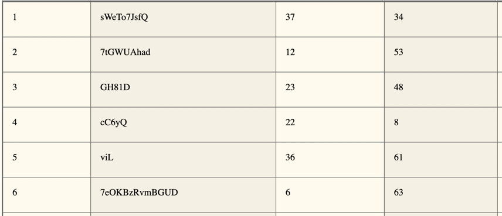
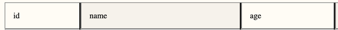
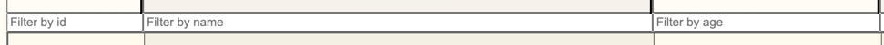
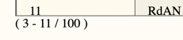

# BigLazyTables for Kolibri
You are currently reading the documentation of BigLazyTables (BLT), a web-based table component, created as part of the [Kolibri UI Toolkit](https://webengineering-fhnw.github.io/Kolibri/index.html).
The goal of this tool is to provide a robust open source table component for the web that can handle large amounts of data. BLT serves as a foundation for developers to build their own custom table components.
BLT is built following the classic MVC structure. The `TableController` holds the core logic and functionality. The `PresentationModel` acts as the widget model of the component. On the view side of things, BLT implements the _**Project Pattern**_. Information on the background of the concept and how to use it can be found here: [Project Pattern](https://dierk.github.io/Home/projectorPattern/ProjectorPattern.html). The different projectors can be used to create different views (see section View Components).

An in-depth documentation of the project can be found here:
[BLT Gitbook](https://biglazytables.gitbook.io/ip6-doc/)
 <br/> <br/>
Features:
- Display large data sets - currently supports up to around 250'000 data entries
- Lazyloading - fetching new data from your provided data source only once they are needed
- Filtering
- Sorting
- Resizable columns
- Customizable dimensions via config
- Easy implementation and expandability for developers

## Implementation

1. Create a new `sampleService.js` file. 
2. Implement the TableService interface with its 3 methods ([serviceDoc.js](/src/doc/serviceDoc.js)). The service needs to implement and expose the two functions `getDataWithFilter` and `getSingleDataEntry`. For an example implementation see [/example_implementations](/example_implementations).
The various data types such as the filter object can be found here: [domainDoc.js](/src/doc/domainDoc.js).

```
/**
 * Interface for service.
 *
 * @typedef { Object } TableService
 *
 * Fetches a single data entry.
 * Applies the given filter to the data set and returns the entry
 * with the given index from that filtered subset.
 * @property { function(?Filter, !number) : Promise<Entry> }  getSingleDataEntry
 *
 * Applies the given filter to the data set and returns a batch of entries
 * ranging from startIndex to endIndex from that filtered subset.
 * The 2nd parameter contains the startIndex of the batch.
 * The 3rd parameter contains the endIndex of the batch.
 * Since the table component does not know the data size of a filtered subset at the time of the fetch,
 * the passed endIndex could be out of bound. This must be handled by the service. In this case
 * the endIndex should be replaced with the highest possible index.
 * As 1st value, the array of entries matching the filter and indeces must be returned.
 * As a 2nd value, the length of the filtered subset must be returned.
 * As a 3rd value, the length of the original, unfiltered data must be returned.
 * All 3 values must be returned as an Array of promises:
 * Promise.all([filteredDataSubsetPromise, filteredDataSubsetSizePromise, totalDataSizePromise])
 * @property { function(!Filter, !number, !number) : PromiseConstructor }  getDataWithFilter
 */
```


3. Create the root DOM element in your template that will be hosting the table. You don't need to add any id or class. Link the stylesheet for the component or copy the css [style.css](src/style.css)
4. In your script, define the parameters for your table in a TableConfig object. <br>
In the example below, the table will be displaying 8 rows of 60px height at a time, resulting in a table body height of 480px. In the columnWidths array the default width of each table column can be defined. The size of the array should match the number of properties in your data entry object.

```
/**
 * Describes the object used for initializing and testing a table component.
 * @typedef  { Object } TableConfig
 * @property { ApplicationConfig } app
 * @property { TestingConfig     } testing
 * @example
 * {
        app: {
            rowHeight: 60,
            nrVisibleRows: 8,
            filterObj: {
                ColumnFilters: ['', '', '', '', '', ''],
                ColumnSorter:
                    {
                        column: undefined,
                        state:  ''
                    }
            },
            columnWidths: [150, 560, 250, 150, 560, 250, 560, 540]
        },
        testing: {
            SIMULATED_FETCH_DELAY: 150,
            TEST_FETCH_DELAY:      150 + 50
        }
    }
 */
```
5. Then initialize the `TablePresentationModel` with newly created TableConfig.
```
const presentationModel = TablePresentationModel(tableConfig);
```
6. Initialize the `TableController` with your model and service by calling its `init()` method.
```
const tableController   = TableController(presentationModel, services);

tableController.init();
```

7. Create the view components you want for your table by using the provided ones or by implementing your own. The order dictates the position of the view inside the DOM. The `TableBody` must be implemented for the table to work.
```
TableHeadersProjector(tableController, rootElement);
FiltersProjector     (tableController, rootElement);
TableBodyProjector   (tableController, rootElement);
TableFooterProjector (tableController, rootElement);
```

## View Components
### TableBody
</br></br>
**[/tableBody](/src/main/projectors/body/tableBodyProjector.js)**</br>
TableBody is the main view and must be implemented. Creates a table body element with n table rows, where n is the number of rows specified at `nrVisibleRows` in the TableConfig. Depending on the specified `rowHeight`, the table can currently supports about 250'000 data entries. 
```
TableBodyProjector(tableController, rootElement);
```

### TableHeaders
</br></br>
**[/tableHeaders](/src/main/projectors/header/tableHeadersProjector.js)**</br>
Creates table headers similar to `<th>` for each key that is found in the data entry object. By clicking on a column, the sorting criteria on the respective column is set to empty (""), "asc" or "desc".
```
TableHeadersProjector(tableController, rootElement);
```

### TableFilters
</br></br>
**[/tableFilters](/src/main/projectors/header/filtersProjector.js)**</br>
Creates an input element for each key that is found in the data entry object. On input, the filter object is updated and a new data set matching the filter is requested from the service.
```
FiltersProjector(tableController, rootElement);
```

### TableFooter
</br></br>
**[/tableFooter](/src/main/projectors/footer/tableFooterProjector.js)**</br>
Displays the currently visible rows in the `TableBody` with their order.
```
TableFooterProjector(tableController, rootElement);
```

